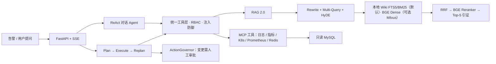

# AIOps Copilot

[English](README_EN.md)

面向故障排查的 AIOps Agent：把告警、运维知识库（RAG）、日志、监控指标和只读数据库编排成**可追溯**的诊断流程。

诊断结论必须落在证据上——每条结论都能回溯到具体工具返回或知识库出处。查不到就明确说查不到，不猜测、不编造。

[](https://github.com/linhongyu510/aiops-copilot/actions/workflows/ci.yml)


---

## 60 秒跑起来

需要 **Python 3.11+**。

```bash
git clone https://github.com/linhongyu510/aiops-copilot.git
cd aiops-copilot
python quickstart.py
```

`quickstart.py` 会自动检测环境、生成 `.env`、按可用依赖选择启动档位，并明确打印哪些能力可用、哪些被跳过。

**完全没有依赖也能看到效果**——离线模式不需要 API Key，也不需要 Docker：

```bash
python quickstart.py --mode demo
```

它会读入一条 Kafka 积压告警，输出「Skill 匹配 → 执行计划 → 验收清单 → Runbook 依据」的完整诊断报告。整条链路确定性、可复现，不调用任何大模型。缺少内核依赖（`pydantic`、`loguru`）时脚本会自动补装。

完整服务栈（Web 控制台 + MCP 工具 + 本地 Wiki 检索）：

```bash
pip install -e '.[full]'        # 或 uv sync --extra full
python quickstart.py            # 打开 http://127.0.0.1:9900
python quickstart.py --stop     # 停止
```

> 单项依赖缺失不会导致启动失败：没有 Docker 也能运行——默认使用本地 Wiki 检索后端（SQLite FTS5/BM25），内置 42 篇运维 Runbook；需要 Dense 向量检索时再设置 AIOPS_RETRIEVAL_BACKEND=milvus 并启动 Docker；没有 `LLM_API_KEY` 就走确定性降级路径。页面上的每个状态卡片都会说明「当前影响是什么、怎么恢复」。

---

## 效果展示：离线 demo 的真实输出

下面是在**全新克隆、无 API Key、无 Docker、无网络依赖**的环境里直接运行 `python quickstart.py --mode demo` 的真实输出（已节选）。同一条告警每次运行都得到**逐字一致**的报告——这正是「证据驱动、可复现」的含义。

```text
▸ 离线诊断演示（无需密钥、无需 Docker）
  ✓ 输入告警：tests/fixtures/kafka_lag_alert.json

# 诊断报告

## 触发
- 标题：KafkaConsumerLagHigh
- 描述：checkout-order 消费速度落后 orders topic
- Labels：alertname=KafkaConsumerLagHigh, consumergroup=checkout-order,
          service=checkout, severity=critical, topic=orders
- 指纹：KafkaConsumerLagHigh@unknown

## 匹配到的 Skill
- skill_id：aiops.kafka_lag
- 标题：Kafka 消费组积压排障
- 匹配度：0.8179   命中理由：alertname=KafkaConsumerLagHigh；symptoms≈0.36

## 执行计划
1. [sk:lag_trend]          查询消费组 lag 趋势，确认突增还是缓增   → prom_query_range
2. [sk:produce_vs_consume] 对比生产/消费速率，判断上游突增还是消费变慢 → prom_query
3. [sk:consumer_log]       检查消费者日志 rebalance/超时/异常        → loki_query
4. [sk:broker_alerts]      检查是否触发 ISR 收缩或 broker 异常       → prom_active_alerts

## 验收清单
1. prom_query → result.value < context.baseline_lag  —— lag 回落到基线以下

## Runbook 参考
### kafka_consumer_lag / 排查顺序
> 1. 按 topic/partition 查看 current offset、log end offset 和 lag 斜率。
> 2. 检查消费者实例数、活跃成员、消费速率和错误率。
> 3. 对齐下游数据库、外部 API、GC 和线程池耗尽。
> ...

  ✓ 离线诊断完成：Skill 匹配 → 计划编排 → 报告渲染，全程确定性、可复现
    这条链路不依赖 LLM，可在无网络环境下复现同一份报告
```

要点：**计划里的每一步都绑定了具体工具与参数**，**验收清单给出可机器判定的成功条件**，**Runbook 依据直接引用知识库原文**——没有任何一句结论是「模型自由发挥」出来的。接上 `LLM_API_KEY` 后，同一套内核会在此基础上补充自然语言归因与对话式追问。

---

## 三种使用姿势

同一套决策内核（[`aiops_core/`](./aiops_core/)：Skill 匹配 / Runbook 抽取 / 计划渲染 / 指纹 / 报告渲染），三种出口，输出语义一致。

| 出口 | 适合场景 | 依赖 | 启动 |
|---|---|---|---|
| **`aiops-cli`** | CI 回放告警、脚本化流水线、离线跑 | 零外部依赖 | `aiops-cli oncall alert.json` |
| **`aiops-mcp`** | 挂给 Codex / Trae / Claude Desktop 当领域知识后端 | `[mcp]` | 配置 `mcpServers` |
| **FastAPI 服务栈** | 常驻诊断平台、Web 控制台、多用户 | `[full]` | `python quickstart.py` |

详见 [AI-Native 快速上手](./docs/ai-native-quickstart.md)、[MCP 挂载](./docs/mcp_codex_trae_mount.md)、[CLI 手册](./docs/aiops_cli_usage.md)。

---

## 架构



### 两套 Agent 工作流

- **知识问答**：ReAct 风格工具调用，动态 Tool Router 每轮最多暴露 8 个相关工具（避免 schema 膨胀影响选择准确率）。
- **复杂诊断**：LangGraph `Plan → Execute → Replan` 状态图。计划是结构化步骤（目标 / 工具提示 / 依赖），无依赖步骤按 DAG **并行**执行；执行结果不符合预期时触发重规划。

### RAG 2.0 检索链路

八路召回 → 融合 → 精排：

```
Query ─┬─ 原始 ────────┬─ BGE Dense ─┐
       ├─ Rewrite ─────┤             ├─ RRF Top-30 ─→ BGE Reranker ─→ Top-5（带 [1]…[5] 引证）
       ├─ Multi-Query×3┤             │
       ├─ HyDE ────────┘             │
       └─ 中文 BM25 ×2 ───────────────┘
```

Dense 与 BM25 **并发**执行（互不依赖）；任一分支失败只降级自己，其余证据保留，并在 `trace.degradations` 中如实标记。重复查询命中 embedding LRU 缓存，不重复编码。

> 这条八路召回 + RRF + Reranker 的完整链路对应 **Milvus 后端**。默认的 `local_wiki` 后端只做 SQLite FTS5/BM25（中文 bigram 分词）检索，不跑 dense 向量、RRF 与 Reranker；需要完整链路时按下方「检索后端」切换。

### 三层记忆

| 层 | 内容 | 作用 |
|---|---|---|
| Episodic | 诊断结束自动沉淀 episode | 规划前检索相似历史事件 |
| Semantic | 服务拓扑 | 影响面 / 爆炸半径分析 |
| Procedural | 人工评审的排障预案 | 按症状匹配注入规划 |

### 安全与治理

- **只读优先**：核心目录 33 个工具（31 MCP + 2 本地）全部只读。
- **变更必须审批**：`risk_level > 0` 的工具调用一律生成待审批提案，无人工批准绝不执行。
- **工具级 RBAC**：viewer / operator / admin 按工具元数据校验，viewer 无法触发数据外发类工具。
- **Prompt 注入防御**：工具输出统一围栏包裹并清除注入行；红队评测集（36 样本 × 5 类攻击）要求 ASR=0。
- **SQL 只读**：仅接受 `SELECT / SHOW / DESCRIBE / EXPLAIN`，拒绝多语句、注释和写入关键字，限制返回行数。生产环境仍必须使用数据库侧只读账号——应用层校验只是第二道防线。

### 检索后端

项目支持两种检索后端，通过 `AIOPS_RETRIEVAL_BACKEND` 环境变量切换：

| 后端 | 默认 | 依赖 | 特点 |
|---|---|---|---|
| `local_wiki` | ✅ | 零外部依赖（Python stdlib SQLite） | 启动时编译 `aiops-docs/` 下 42 篇 Runbook，基于 FTS5/BM25 + 中文 bigram 分词，确定性可复现 |
| `milvus` | | Docker + Milvus + BGE 嵌入模型 | Dense 向量检索 + BM25 稀疏检索，八路召回 + RRF + Reranker |

```bash
# 默认：本地 Wiki，无需 Docker
python quickstart.py

# 可选：Milvus 向量后端
AIOPS_RETRIEVAL_BACKEND=milvus python quickstart.py
```

---

## 技术栈

Python 3.11+ · FastAPI · LangChain · LangGraph · FastMCP · Milvus · BGE（`bge-large-zh-v1.5` + `bge-reranker-v2-m3`）· SQLAlchemy 2 · Pytest

---

## 配置

`quickstart.py` 会自动生成 `.env`。接入真实模型只需填一项：

```dotenv
LLM_API_KEY=your-key-here
```

共享或生产环境应启用鉴权：

```dotenv
AIOPS_AUTH_ENABLED=true
AIOPS_API_KEYS=viewer-secret:viewer,operator-secret:operator,admin-secret:admin
AIOPS_CORS_ORIGINS=https://your-demo.example.com
```

客户端通过 `X-API-Key` 或 Bearer Token 传入。日志只保留密钥指纹，不记录原始密钥。完整配置项见 [`.env.example`](./.env.example)。

### 可选集成

核心不依赖任何外部平台。要接入自建系统，在 `integrations/` 下新增一个目录，
然后按需启用：

```dotenv
AIOPS_ENABLED_INTEGRATIONS=windos
```

集成需要提供三样东西：`TOOL_SPECS`（声明 `read_only` / `risk_level`，供路由、
RBAC 与审批复用）、`TOOL_GROUPS`（路由关键词，启用时自动合并）、
`register_mcp_tools(mcp)`（挂载工具）。未启用的集成不会被导入，行为与该目录不
存在完全一致。

[`integrations/windos/`](./integrations/windos/) 是一个完整示例，可直接作为模板。

---

## 项目边界（如实声明）

这些是当前实现的真实边界，不做夸大：

- CLS 与监控 MCP 提供可演示的**模拟数据**接口；Prometheus / Loki / K8s / Docker / Redis / MySQL 为真实 HTTP 集成，未配置时明确返回不可用，不伪造结果。
- 服务拓扑与预案库默认使用**内置演示数据**（返回中显式标注 `builtin-demo`），可通过 `AIOPS_TOPOLOGY_PATH` / `AIOPS_PLAYBOOKS_PATH` 接入真实数据。
- 评测查询集当前由**规则种子生成**，人工复核状态为 `pending`。只能表述为「可复现离线查询集」，不能表述为「人工标注评测集」。
- incident 状态机与变更提案默认单进程内存态；`AIOPS_COORDINATION_BACKEND=redis` 时切换为 Redis 共享。指标 registry 与熔断状态仍是单进程内存态，`/production/readiness` 会如实暴露这些阻断项。
- 自治诊断仅使用只读工具集，不执行任何变更。
- 事件记忆检索使用 n-gram TF-IDF（无模型依赖、确定性），替换为 embedding 检索的接口已预留。
- `integrations/windos/` 对接的是作者另一套独立自建系统，克隆者无法访问；它默认关闭，仅作为集成契约的参考实现保留。

---

## 相关项目

- [mcp-lint](https://github.com/linhongyu510/mcp-lint) —— 同作者的 MCP 工具定义静态安全 linter：在把 MCP Server 接入 Agent 之前，先静态查出提示注入、工具投毒、无约束 schema 与配置卫生问题，零依赖、可接入 CI。
- [agent-memory-benchmark](https://github.com/linhongyu510/agent-memory-benchmark) —— 同作者的 Agent 长期记忆评测基准。**与本项目的边界**：agent-memory-benchmark 是去**评测**一个记忆系统在六项能力上的召回与一致性；AIOps Copilot 则是把三层记忆（情节/语义/程序）作为诊断的一路输入去**使用**。一个衡量记忆，一个应用记忆。
- [EvalForge](https://github.com/linhongyu510/EvalForge) —— 同作者的「证据链接」Agent 评测与失败诊断工作台。**与本项目的边界**：EvalForge 是**通用**的 Agent 评测/诊断框架（被测对象是任意 Agent）；AIOps Copilot 是**领域**Agent（SRE/故障排查），只是它本身以证据优先的方式构建。要评测一个 Agent 用 EvalForge，要排查一次故障用本项目。

---

## License

[MIT](./LICENSE)
