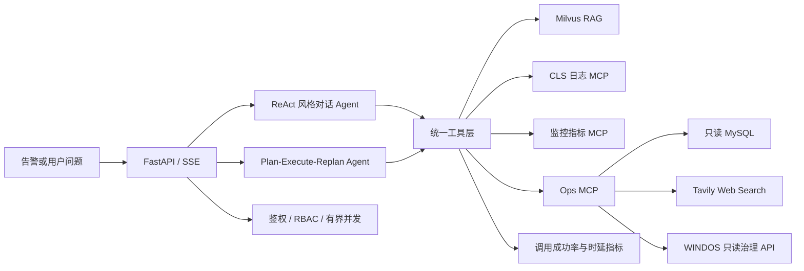

# AIOps Copilot：智能 OnCall Agent

面向实习作品集的可运行 AIOps Agent：把内部运维知识、日志、监控指标、只读 MySQL 数据和联网检索统一编排为可追踪的排障流程，并提供可复现的 RAG 与端到端 Agent 评测。

## 核心能力

- **双 Agent 工作流**：知识问答使用 ReAct 风格工具调用 Agent；复杂诊断使用 LangGraph `Plan → Execute → Replan` 状态图。
- **DeepSeek 模型路由**：工具规划与执行使用 V4 Flash 非思考模式，最终诊断报告使用 V4 Pro 思考模式，配置集中在 LLMFactory 且健康接口不暴露密钥。
- **MCP 工具层**：统一发现并编排 17 个 MCP 工具与 2 个本地工具，接入 CLS 日志、CPU/内存监控、只读 MySQL、Tavily 联网检索和 WINDOS 只读诊断；MCP 调用支持错误分类、最多 3 次指数退避与随机抖动。
- **RAG 链路**：Markdown 分层切分、开源 BGE 中文模型本地 Embedding、Milvus 检索、知识文档上传与自动索引；可按配置切换 BGE-M3 或 DashScope。
- **可靠性与安全**：Agent 请求采用有界并发和快速过载保护；API Key 支持 viewer/operator/admin 角色，上传、索引与会话接口按最小权限控制，MySQL 查询限制只读语法、schema 与最大返回行数。
- **可观测性**：为请求注入/透传 `X-Request-ID` 与 W3C Trace Context，记录 HTTP 与工具调用次数、成功率、并发量以及平均/P50/P95 时延；统一 Compose 提供 OTel Collector、Jaeger、Prometheus 和预置 Grafana 面板。
- **评测体系**：600 条固定 RAG 查询按模板隔离为 train/dev/test，支持切分策略、Chunk Size、Overlap、Top-K 共 54 组对照、错误归因，以及 30 条端到端 Agent 任务。

## 架构



## 技术栈

Python 3.11+、FastAPI、LangChain、LangGraph、FastMCP、Milvus、Sentence Transformers/BGE、DeepSeek V4、SQLAlchemy 2、PyMySQL、Tavily、Pytest。

## 快速启动

1. 复制配置并填写密钥：

```powershell
Copy-Item .env.example .env
```

2. Windows 一键启动：

```powershell
.\start-windows.bat
```

脚本会同步本地 Embedding 依赖、启动 Milvus；当 LLM_PROVIDER=ollama 时还会启动 GPU Ollama 容器并确保 LLM_MODEL 已下载，然后启动 3 个 MCP 服务、FastAPI 并索引 aiops-docs。首次运行需要下载镜像和模型，耗时会明显长于后续启动。

若默认端口已被其他项目占用，可在启动前覆盖对应端口；脚本会在启动服务前完成端口预检：

```powershell
$env:MCP_CLS_PORT = 18003
.\start-windows.bat
```

可选：启动带有告警、指标和历史事件种子数据的只读 MySQL 演示库：

```powershell
docker compose -f demo-mysql.yml up -d
```

启动 PostgreSQL、Redis、Milvus、MCP、双 API 副本与完整可观测栈：

```powershell
docker compose -f compose.yml --profile full up -d --wait
```

只启动 OTel Collector、Jaeger、Prometheus 与 Grafana：

```powershell
docker compose -f compose.yml up -d jaeger otel-collector prometheus grafana
```

若 `mysql:8.4` 出现 `unexpected commit digest`，通常是多个第三方 registry mirror 的缓存 manifest 过期。本项目 Compose 使用已与 Docker Hub 官方 manifest 核验一致的 DaoCloud 代理并固定 digest；本机 Docker Engine 也应移除失效的全局 mirror 后重启 Docker Desktop。

若 Windows 系统代理使 DaoCloud 层下载长期停在 `0B`，可在系统代理例外列表加入 `*.daocloud.io` 和 `*.daocloud.vip`。本机验证中，绕过本地代理后镜像可在数秒内完成续传。

Linux/macOS：

```bash
uv sync --extra dev --extra local-embeddings
make init
```

3. 访问：

- Web UI：<http://127.0.0.1:9900>
- OpenAPI：<http://127.0.0.1:9900/docs>
- 健康检查：<http://127.0.0.1:9900/health>
- 存活检查：<http://127.0.0.1:9900/live>
- 就绪检查：<http://127.0.0.1:9900/ready>
- 生产就绪审计：<http://127.0.0.1:9900/production/readiness>
- 工具指标：<http://127.0.0.1:9900/api/metrics/tools>
- Prometheus 指标：<http://127.0.0.1:9900/api/metrics>
- Trace 联动探针：<http://127.0.0.1:9900/api/observability/trace-probe>
- Jaeger：<http://127.0.0.1:16686>
- Prometheus：<http://127.0.0.1:9090>
- Grafana：<http://127.0.0.1:3300>

生产或共享演示环境应启用 API Key：

```dotenv
AIOPS_AUTH_ENABLED=true
AIOPS_API_KEYS=viewer-secret:viewer,operator-secret:operator,admin-secret:admin
AIOPS_CORS_ORIGINS=https://your-demo.example.com
AIOPS_MAX_CONCURRENT_AGENT_REQUESTS=8
AIOPS_REQUEST_QUEUE_TIMEOUT_SECONDS=1.0
```

客户端通过 `X-API-Key` 或 Bearer Token 传入密钥。日志与请求标识只保留密钥指纹，不记录原始密钥。`/live` 保持公开以供编排器探活；受保护的 `/api/*` 接口按 HTTP 方法和资源风险校验角色。

## MCP 服务

除日志、监控、只读 MySQL 和 Web Search 外，Ops MCP 还提供 6 个 WINDOS 只读自动运维工具：健康/就绪与生产配置闸门、排程队列、Agent 工具指标、治理状态、最近审计事件和综合诊断快照。HTTP 客户端复用连接池并透传请求 ID；综合诊断采用并行请求与部分失败降级，单个端点异常不会丢失其余证据。配置 `WINDOS_BASE_URL`，受控模式下使用 viewer 权限的 `WINDOS_API_KEY`；该接入不会取消任务、重启服务或写入业务数据。

| 服务 | 端口 | 能力 |
|---|---:|---|
| CLS | 8003 | 日志主题定位与日志检索 |
| Monitor | 8004 | CPU、内存监控查询 |
| Ops | 8005 | MySQL 只读查询、联网检索 |

数据库工具只接受 `SELECT / SHOW / DESCRIBE / EXPLAIN`，拒绝多语句、SQL 注释和写入/管理关键字，并限制最大返回行数。生产环境仍必须使用数据库侧的只读账号和 schema 白名单。

CLS/Monitor/Ops 的监听地址与端口可分别通过 MCP_CLS_HOST/PORT、MCP_MONITOR_HOST/PORT、MCP_OPS_HOST/PORT 配置；API 客户端 URL 通过对应的 MCP_*_URL 配置。

## 评测

生成固定数据集：

```powershell
.\.venv\Scripts\python.exe -m evaluation.generate_datasets
```

导出人工复核表并校验标签：

```powershell
.\.venv\Scripts\python.exe -m evaluation.review_labels export
.\.venv\Scripts\python.exe -m evaluation.review_labels validate
```

离线工程冒烟评测：

```powershell
.\.venv\Scripts\python.exe -m evaluation.rag_eval --backend hashing --split dev
```

安装并使用真实开源 BGE Embedding 的简历级评测：

```powershell
uv sync --extra dev --extra local-embeddings
.\.venv\Scripts\python.exe -m evaluation.rag_eval --backend local --split dev
.\.venv\Scripts\python.exe -m evaluation.rag_baselines --split test
```

默认通过 ModelScope 下载 `BAAI/bge-small-zh-v1.5`，便于国内网络和 CPU 环境复现；修改 `LOCAL_EMBEDDING_SOURCE`、`LOCAL_EMBEDDING_MODEL` 与 `EMBEDDING_DIMENSIONS` 可切换其他 Sentence Transformers 模型。如需对照云端模型，可设置 `EMBEDDING_PROVIDER=dashscope` 并运行 `--backend dashscope`。切换模型后请使用新的 `MILVUS_COLLECTION_NAME` 或重建索引，不要混用不同模型生成的向量。

端到端 Agent 评测（需要 API、MCP、Milvus 和模型服务均正常）：

```powershell
.\.venv\Scripts\python.exe -m evaluation.agent_eval --sample 30
```

评测报告写入 `evaluation/reports/`。参数选择只看 dev，锁定配置后用 test 汇报最终结果。当前标签仍由规则种子生成且人工状态为 pending；可以表述为“可复现离线查询集”，不能表述为“人工标注评测集”。

## 测试与代码质量

```powershell
.\.venv\Scripts\python.exe -m pytest tests -q --no-cov
.\.venv\Scripts\python.exe -m ruff check app mcp_servers evaluation tests
```

测试覆盖 SQL 只读规则、MCP 错误分类与重试、工具/请求指标、配置环境隔离、上传路径安全、Agent/API 流程、运行时分块上限，以及 600 条数据集稳定生成和防泄漏切分。

当前可复现基线为 **135 个自动化测试全部通过，语句覆盖率 73.16%，19 个工具（17 MCP + 2 本地），Ruff 与前端 JavaScript 语法检查通过**。数字由 JUnit、Coverage JSON 和源码 AST 自动生成到 `artifacts/project_evidence.json`，避免简历口径漂移。测试覆盖 API 鉴权/RBAC、请求 ID、过载拒绝、SSE 事件游标与幂等回放、熔断/半开恢复/隔离舱、PostgreSQL checkpoint、Tracing 接入、前端交互契约及 Replanner/向量服务。

## 项目边界

- CLS 与监控服务当前提供可演示的模拟数据接口，接入真实生产系统时需要替换为云厂商或自建监控 API。
- MySQL 和 Tavily 工具在缺少配置时会明确返回不可用，不会伪造结果。
- `evaluation/datasets/rag_queries.jsonl` 当前由规则种子生成；只有复核并将 `review_status` 改为 `approved` 后，才能表述为“人工标注评测集”。
- Milvus 运行数据默认写入 `.runtime/`；旧的 `volumes/` 不会自动删除或迁移。
- RAG 对话与 Plan–Execute–Replan 诊断图可切换 PostgreSQL checkpoint；SSE replay、幂等生产者租约与 admission control 可切换 Redis，并已通过双客户端交叉验证。指标 registry 与熔断状态仍是单进程内存态，`/production/readiness` 会如实暴露这些阻断项，不把本机演示宣称为亿级生产系统。

简历写法及证据清单见 [`docs/resume_project.md`](docs/resume_project.md)。
针对抖音服务架构后端实习岗位的映射、演示路径与下一阶段计划见 [`docs/backend_internship_pitch.md`](docs/backend_internship_pitch.md)。
本次完整测试、启动冒烟与 WINDOS 联动结果见 [`docs/verification_2026-07-24.md`](docs/verification_2026-07-24.md)。
P0–P3 可靠性实验、模型路由与证据边界见 [`docs/reliability_validation_2026-07-24.md`](docs/reliability_validation_2026-07-24.md)。
