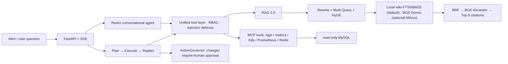

# AIOps Copilot

[简体中文](README.md)

An AIOps agent for incident troubleshooting: it orchestrates alerts, an ops knowledge base (RAG), logs, metrics and read-only databases into a **traceable** diagnostic workflow.

Every conclusion must rest on evidence — each one traces back to a concrete tool result or a knowledge-base source. If the answer isn't in the evidence, it says so explicitly. No guessing, no fabrication.

[](https://github.com/linhongyu510/aiops-copilot/actions/workflows/ci.yml)


---

## Run it in 60 seconds

Requires **Python 3.11+**.

```bash
git clone https://github.com/linhongyu510/aiops-copilot.git
cd aiops-copilot
python quickstart.py
```

`quickstart.py` auto-detects the environment, generates `.env`, picks a startup tier based on the dependencies you have, and prints exactly which capabilities are available and which are skipped.

**You can see it work with no dependencies at all** — the offline mode needs no API key and no Docker:

```bash
python quickstart.py --mode demo
```

It reads a Kafka consumer-lag alert and emits a full diagnostic report: "skill match → execution plan → acceptance checklist → runbook citation". The whole chain is deterministic and reproducible, and calls no LLM. If the kernel dependencies (`pydantic`, `loguru`) are missing, the script installs them automatically.

Full service stack (web console + MCP tools + local wiki retrieval):

```bash
pip install -e '.[full]'        # or: uv sync --extra full
python quickstart.py            # opens http://127.0.0.1:9900
python quickstart.py --stop     # stop
```

> A single missing dependency never breaks startup: no Docker is fine — the default is a local wiki retrieval backend (SQLite FTS5/BM25) with 42 built-in ops runbooks; set `AIOPS_RETRIEVAL_BACKEND=milvus` and start Docker only when you want dense-vector retrieval; with no `LLM_API_KEY` it takes the deterministic fallback path. Every status card on the page explains "what's affected right now and how to recover".

---

## What it looks like: the real output of the offline demo

Below is the real output of `python quickstart.py --mode demo` in a **freshly cloned, no-API-key, no-Docker, no-network** environment (excerpted). The same alert produces a **byte-for-byte identical** report every run — that is what "evidence-driven and reproducible" means.

```text
▸ Offline diagnostic demo (no key, no Docker)
  ✓ Input alert: tests/fixtures/kafka_lag_alert.json

# Diagnostic report

## Trigger
- Title: KafkaConsumerLagHigh
- Description: checkout-order consumption is falling behind the orders topic
- Labels: alertname=KafkaConsumerLagHigh, consumergroup=checkout-order,
          service=checkout, severity=critical, topic=orders
- Fingerprint: KafkaConsumerLagHigh@unknown

## Matched skill
- skill_id: aiops.kafka_lag
- Title: Kafka consumer-group lag triage
- Score: 0.8179   reason: alertname=KafkaConsumerLagHigh; symptoms≈0.36

## Execution plan
1. [sk:lag_trend]          query consumer-group lag trend, spike vs. gradual   → prom_query_range
2. [sk:produce_vs_consume] compare produce/consume rate, upstream surge vs. slow consumer → prom_query
3. [sk:consumer_log]       check consumer logs for rebalance/timeout/errors    → loki_query
4. [sk:broker_alerts]      check for ISR shrink or broker anomalies            → prom_active_alerts

## Acceptance checklist
1. prom_query → result.value < context.baseline_lag  —— lag back below baseline

## Runbook reference
### kafka_consumer_lag / triage order
> 1. Inspect current offset, log end offset and lag slope per topic/partition.
> 2. Check consumer instance count, active members, consume rate and error rate.
> 3. Rule out downstream DB, external API, GC and thread-pool exhaustion.
> ...

  ✓ Offline diagnosis complete: skill match → plan → report, fully deterministic and reproducible
    This chain does not depend on an LLM and reproduces the same report offline
```

The point: **every plan step is bound to a concrete tool and parameters**, **the acceptance checklist gives machine-decidable success conditions**, and **the runbook basis cites the knowledge base verbatim** — not one conclusion is "the model freestyling". Add an `LLM_API_KEY` and the same kernel layers natural-language root-causing and conversational follow-ups on top.

---

## Three ways to use it

One decision kernel ([`aiops_core/`](./aiops_core/): skill matching / runbook extraction / plan rendering / fingerprinting / report rendering), three exits, semantically consistent output.

| Exit | Best for | Deps | Start |
|---|---|---|---|
| **`aiops-cli`** | replaying alerts in CI, scripted pipelines, offline runs | zero external deps | `aiops-cli oncall alert.json` |
| **`aiops-mcp`** | a domain-knowledge backend for Codex / Trae / Claude Desktop | `[mcp]` | configure `mcpServers` |
| **FastAPI service stack** | a resident diagnostic platform, web console, multi-user | `[full]` | `python quickstart.py` |

See [AI-Native quickstart](./docs/ai-native-quickstart.md), [MCP mount](./docs/mcp_codex_trae_mount.md) and the [CLI manual](./docs/aiops_cli_usage.md).

---

## Architecture



### Two agent workflows

- **Knowledge Q&A**: ReAct-style tool calling. A dynamic tool router exposes at most 8 relevant tools per turn (to keep schema bloat from hurting selection accuracy).
- **Complex diagnosis**: a LangGraph `Plan → Execute → Replan` state graph. The plan is structured steps (goal / tool hint / dependencies); independent steps run **in parallel** as a DAG; results that don't match expectations trigger a replan.

### RAG 2.0 retrieval chain

Eight-way recall → fusion → rerank:

```
Query ─┬─ original ──────┬─ BGE Dense ─┐
       ├─ Rewrite ───────┤             ├─ RRF Top-30 → BGE Reranker → Top-5 (with [1]…[5] citations)
       ├─ Multi-Query×3  ┤             │
       ├─ HyDE ──────────┘             │
       └─ Chinese BM25 ×2 ─────────────┘
```

Dense and BM25 run **concurrently** (independent of each other); a failed branch degrades only itself, the rest of the evidence is kept and truthfully marked in `trace.degradations`. Repeated queries hit an embedding LRU cache and are not re-encoded.

> This full eight-way + RRF + Reranker chain corresponds to the **Milvus backend**. The default `local_wiki` backend does SQLite FTS5/BM25 (Chinese bigram tokenization) only — no dense vectors, RRF or reranker; switch backends (below) when you want the full chain.

### Three memory layers

| Layer | Content | Purpose |
|---|---|---|
| Episodic | an episode auto-persisted at diagnosis end | retrieve similar past incidents before planning |
| Semantic | service topology | impact / blast-radius analysis |
| Procedural | human-reviewed troubleshooting playbooks | matched by symptom and injected into planning |

### Security and governance

- **Read-only first**: all 33 core tools (31 MCP + 2 local) are read-only.
- **Changes require approval**: any tool call with `risk_level > 0` produces a pending proposal and never executes without human approval.
- **Tool-level RBAC**: viewer / operator / admin validated against tool metadata; a viewer cannot trigger data-exfiltration tools.
- **Prompt-injection defense**: tool output is uniformly fenced and injection lines stripped; a red-team set (36 samples × 5 attack classes) requires ASR = 0.
- **Read-only SQL**: only `SELECT / SHOW / DESCRIBE / EXPLAIN` accepted; multi-statement, comments and write keywords rejected; row count capped. Production must still use a DB-side read-only account — the app-layer check is only a second line of defense.

### Retrieval backends

Two backends, switched via the `AIOPS_RETRIEVAL_BACKEND` env var:

| Backend | Default | Deps | Notes |
|---|---|---|---|
| `local_wiki` | ✅ | zero external deps (Python stdlib SQLite) | compiles 42 runbooks under `aiops-docs/` at startup; FTS5/BM25 + Chinese bigram; deterministic and reproducible |
| `milvus` | | Docker + Milvus + BGE embedding model | dense-vector + BM25 sparse retrieval, eight-way recall + RRF + Reranker |

```bash
# Default: local wiki, no Docker needed
python quickstart.py

# Optional: Milvus vector backend
AIOPS_RETRIEVAL_BACKEND=milvus python quickstart.py
```

---

## Tech stack

Python 3.11+ · FastAPI · LangChain · LangGraph · FastMCP · Milvus · BGE (`bge-large-zh-v1.5` + `bge-reranker-v2-m3`) · SQLAlchemy 2 · Pytest

---

## Configuration

`quickstart.py` generates `.env` for you. Connecting a real model takes one line:

```dotenv
LLM_API_KEY=your-key-here
```

Shared or production deployments should enable auth:

```dotenv
AIOPS_AUTH_ENABLED=true
AIOPS_API_KEYS=viewer-secret:viewer,operator-secret:operator,admin-secret:admin
AIOPS_CORS_ORIGINS=https://your-demo.example.com
```

Clients pass it via `X-API-Key` or a Bearer token. Logs keep only a key fingerprint, never the raw key. See [`.env.example`](./.env.example) for the full set.

### Optional integrations

The core depends on no external platform. To wire in a self-hosted system, add a directory under `integrations/` and enable it:

```dotenv
AIOPS_ENABLED_INTEGRATIONS=windos
```

An integration provides three things: `TOOL_SPECS` (declaring `read_only` / `risk_level`, reused by routing, RBAC and approval), `TOOL_GROUPS` (routing keywords, merged in when enabled), and `register_mcp_tools(mcp)` (mounts the tools). A disabled integration is never imported and behaves exactly as if its directory didn't exist. [`integrations/windos/`](./integrations/windos/) is a complete example you can use as a template.

---

## Project boundaries (stated honestly)

These are the real limits of the current implementation, without embellishment:

- CLS and monitoring MCP expose demonstrable **mock-data** interfaces; Prometheus / Loki / K8s / Docker / Redis / MySQL are real HTTP integrations that return "unavailable" when unconfigured rather than faking results.
- Service topology and the playbook store default to **built-in demo data** (marked `builtin-demo` in responses); wire in real data via `AIOPS_TOPOLOGY_PATH` / `AIOPS_PLAYBOOKS_PATH`.
- The evaluation query set is currently **rule-seed generated**, with human review status `pending`. It can only be described as a "reproducible offline query set", not a "human-labeled evaluation set".
- The incident state machine and change proposals default to single-process in-memory state; `AIOPS_COORDINATION_BACKEND=redis` switches them to Redis-shared. The metrics registry and circuit-breaker state remain single-process in-memory, and `/production/readiness` honestly exposes these blockers.
- Autonomous diagnosis uses the read-only toolset only and performs no changes.
- Incident-memory retrieval uses n-gram TF-IDF (no model dependency, deterministic); an interface for swapping in embedding retrieval is reserved.
- `integrations/windos/` targets a separate self-hosted system the author maintains, inaccessible to cloners; it is off by default and kept only as a reference implementation of the integration contract.

---

## Related projects

- [mcp-lint](https://github.com/linhongyu510/mcp-lint) — the author's static security linter for MCP tool definitions: catch prompt injection, tool poisoning, unconstrained schemas and config-hygiene issues *before* wiring an MCP server into an agent. Zero-dependency, CI-friendly.
- [agent-memory-benchmark](https://github.com/linhongyu510/agent-memory-benchmark) — the author's benchmark for agent long-term memory. **How it differs from this project**: agent-memory-benchmark *scores a memory system's* recall/consistency across six capabilities; AIOps Copilot *uses* three memory layers (episodic/semantic/procedural) as one input to diagnosis. One measures memory, the other applies it.
- [EvalForge](https://github.com/linhongyu510/EvalForge) — the author's evidence-linked evaluation & failure-diagnosis workbench for agents. **How it differs**: EvalForge is a *general* agent evaluation/diagnosis harness (any agent under test); AIOps Copilot is a *domain* agent (SRE/incident troubleshooting) that happens to be built evidence-first. If you want to evaluate an agent, reach for EvalForge; if you want to diagnose an incident, reach for this.

---

## License

[MIT](./LICENSE)
