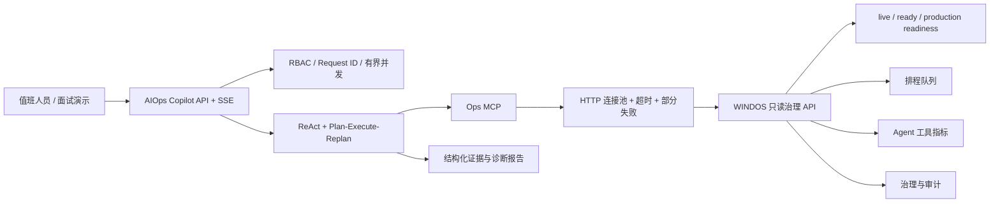

# 面向“抖音服务架构后端实习生”的项目包装与改进结论

## 结论

AIOps Copilot 可以与 `D:\Work\WINDOS` 联动，而且联动后比把两个项目各自描述成普通 Agent Demo 更适合服务架构岗位：

- **WINDOS 是被治理的业务系统**：提供健康、生产闸门、异步排程、Agent 指标、治理状态和审计事件。
- **AIOps Copilot 是只读可靠性控制面**：通过 Ops MCP 并发采集证据，进行故障诊断与解释，不越权执行取消、重启或数据写入。
- **共同主线是后端架构能力**：接口拆分、数据隔离、过载保护、部分失败、可观测性、安全边界、自动化测试和生产就绪判断，而不是只强调 LLM。

这套定位与岗位中的“高可用、弹性、低成本、系统调优、质量控制、高并发、数据隔离、系统解耦”有直接对应关系。机器学习/异构计算只属于加分项，不应盖过后端主线。

## 已完成的工程改进

| 岗位关注点 | 当前实现与证据 | 面试时的准确说法 |
|---|---|---|
| 高并发与弹性 | Agent 入口使用有界信号量；等待超时返回 429 和 `Retry-After` | “通过 admission control 防止慢模型把工作线程和下游连接拖垮” |
| 高可用 | `/live` 与 `/ready` 分离；Milvus 故障时非 RAG 能力可降级；WINDOS 综合诊断允许单端点失败 | “区分进程存活、依赖就绪和业务生产就绪，避免一个依赖故障导致所有诊断证据丢失” |
| 系统解耦 | 三个 MCP Server 隔离日志、监控、数据库/Web/WINDOS；Agent 只依赖统一工具协议 | “新增治理数据源无需改 Agent 主流程，只注册工具和 schema” |
| 数据隔离 | API Key 角色为 viewer/operator/admin；认证会话 ID 加密钥指纹前缀；MySQL 限定只读语法和 schema | “会话、资源与高风险操作都按身份和角色隔离；应用校验不替代数据库只读账号” |
| 低成本 | 默认本地 BGE/Ollama；快/慢模型按任务路由；并发上限避免无界模型消耗 | “低成本来自模型路由和资源预算，而不是牺牲可靠性” |
| 可观测性 | 请求 ID、HTTP/工具调用计数、成功率、并发、P50/P95、Prometheus 输出 | “指标可按请求和工具定位慢点，WINDOS 调用继续透传请求 ID” |
| 质量控制 | 135 个测试、73.16% 语句覆盖率、Ruff、锁文件校验、GitHub Actions、非 root Dockerfile | “测试覆盖安全规则、流式生命周期、过载、降级、持久化和前端接口契约” |
| 前端一致性 | AIOps 工作台复用 WINDOS 的冷灰、海洋蓝/青色、紧凑顶栏、状态卡与轻量边框语言 | “两个项目从业务系统到可靠性控制面形成统一演示体验” |

## 联动架构

关键边界：

1. AIOps 使用 WINDOS 的 viewer Key，只读查询，不复用管理员身份。
2. API 健康不等于生产就绪；报告必须同时展示阻断项和警告。
3. 队列端点返回 503 `asynchronous_scheduling_disabled` 时，含义是“能力未启用”，不能写成“当前无积压”。
4. WINDOS 不可达时，AIOps 返回带来源、端点、状态和时延的失败证据，不伪造健康结论。

## 最适合简历的三条

**AIOps Copilot｜系统可靠性诊断与治理控制面｜独立开发**  
**技术栈：** Python / FastAPI / LangGraph / MCP / Milvus / Prometheus / Pytest

- 设计 ReAct 与 Plan–Execute–Replan 双工作流，通过 3 个 MCP Server 统一发现并编排 19 个本地/MCP 工具，接入日志、监控、只读 MySQL、联网检索与 WINDOS 治理 API，形成多源证据采集、动态重规划和流式诊断闭环。
- 面向慢模型和故障依赖实现有界并发、429 过载保护、错误分类、指数退避与随机抖动、HTTP 连接池和部分失败降级；拆分 live/ready/production readiness，补充 API Key RBAC、会话隔离、只读 SQL/schema 边界、请求 ID 与 Prometheus 指标。
- 建立 135 个自动化测试与 CI 质量门禁，语句覆盖率 73.16%；构建 600 条按模板隔离的 RAG 查询，在 120 条 held-out test 上将 BGE Hit@5 从 95.83% 提升至 98.33%，并对 Agent 任务记录成功率和端到端 P50/P95。

若版面只能容纳两条，保留前两条；服务架构岗位更看重治理与可靠性，RAG 实验可以在面试中展开。

## 五分钟演示顺序

1. 打开 WINDOS，说明它是业务侧排程系统；展示健康、生产闸门和治理状态。
2. 打开 AIOps Copilot，展示与 WINDOS 一致的视觉语言和四项实时状态指标。
3. 点击“检查 WINDOS”，发送只读综合诊断提示词。
4. 在流式事件中指出工具选择、并行采集、失败项与请求 ID。
5. 对照 `/api/metrics/tools` 与 `/api/metrics` 解释成功率、P50/P95 和 Prometheus 接入方式。
6. 主动展示 `/production/readiness` 的阻断项，说明当前仍是本机单实例演示，不把它包装成线上生产系统。

## 面试应重点准备的追问

### 为什么限流放在 Agent 入口，而不是只限制 HTTP QPS

瓶颈是模型调用、MCP 请求和连接占用时长，而非单纯请求数。并发信号量约束在途重任务；短暂排队后快速返回 429，让调用方退避，能避免慢依赖触发级联堆积。多副本部署时应把实例并发预算与网关限流、全局队列结合。

### 部分失败为什么比重试更重要

综合诊断同时访问多个 WINDOS 端点。单一端点连续重试可能放大故障并拖长尾延迟；对独立证据源并行请求、设置超时并保留成功结果，可以先给出不完整但真实的诊断。报告必须显式标记缺失证据，不能把缺失当正常。

### 如何证明数据隔离

API 身份决定会话命名空间；viewer 只能读指标和状态，operator 才能发起诊断，admin 才能上传和重建索引。数据库查询还需要应用层语法/schema 校验和数据库侧只读账号两道防线。当前 API Key 方案适合个人项目演示，生产应接入统一身份、密钥轮换和集中审计。

### 为什么生产就绪仍会失败

这是刻意的诚实闸门：对话与诊断图 checkpoint 已支持 PostgreSQL，SSE replay、幂等租约和 admission control 已支持 Redis，且均通过双客户端交叉验证；Tracing 与依赖级熔断/隔离也已接入。但指标 registry 与熔断状态仍是单进程状态，OTLP 后端默认未启用，Milvus 与 MCP 仍依赖本机服务。因此“测试通过”表示当前设计契约成立，不等于已经达到亿级生产容量。

## 后续优化优先级

### P0：已完成

- 保存一次完整联动演示记录：WINDOS 正常、单端点 503、WINDOS 不可达三种场景。
- 把简历里的测试数、覆盖率和工具数固定为本次全量验证结果，后续代码变化后重新生成。
- 准备一个过载测试图：并发数、拒绝率、P95 与下游错误率，避免只讲实现没有效果数据。

### P1：分布式状态已完成，集中观测仍需补齐

- RAG 对话与诊断工作流已接入 PostgreSQL checkpoint；Redis 承载 SSE replay、幂等生产者租约和分布式 admission control，双客户端验证证据位于 `artifacts/reliability/`。
- OpenTelemetry 已通过 ASGI/HTTPX 与 W3C header 把 AIOps 只读探针、MCP `windos_health` 和 WINDOS HTTP 请求串成同一 Trace；Collector、Jaeger、Prometheus、Grafana 的实测证据位于 `artifacts/reliability/observability_stack.json`。
- 为依赖增加熔断、半开探测和隔离舱；通过故障注入证明恢复过程。
- 为 SSE 增加断线重连、事件 ID/游标和幂等语义。

### P2：已完成可复现实验

- 用固定脚本压测 1/4/8/16 并发，汇报吞吐、P50/P95、429 比例与内存。
- 对比本地模型、Flash 模型和 Pro 模型的准确率、时延与成本，给出路由阈值。
- 将工具指标细分到 error class，建立延迟与错误预算面板。

### P3：工程项完成，人工数据项待真实输入

- 为 Replanner、Milvus 容器集成和请求取消传播补测试，将覆盖率提升到 70% 以上。
- 引入脱敏真实告警和人工复核标签，避免把规则标签称为人工标注。
- 若投递岗位第 6 条比重较高，再补异构推理或批处理实验；没有数据时不要写 GPU 性能优化。
